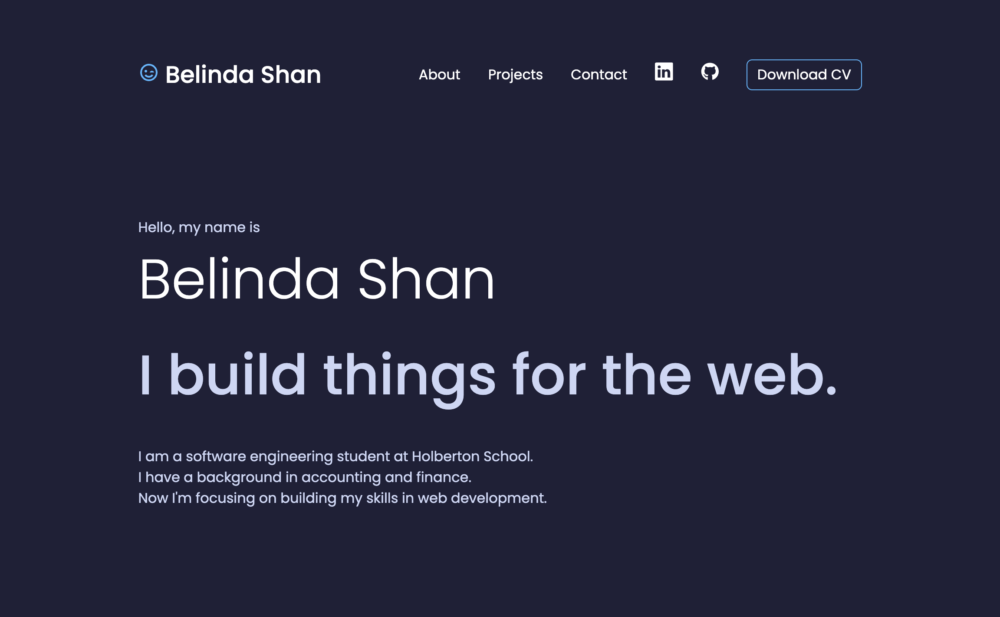

# Belinda Shan's Portfolio

Welcome to the repository of my personal portfolio website. 🌟 This project, built using React, showcases my professional journey, skills, academic background, and a selection of projects I have developed. The website serves as an interactive resume, offering insight into my capabilities and achievements.

## Table of Contents

- [Website](#website)
- [Technologies Used](#technologies-used)
- [Features](#features)
- [Installation](#installation)
- [Usage](#usage)
- [Customization](#customization)
- [Contributing](#contributing)
- [License](#license)

## Website

You can check out my portfolio website live at [Belinda Shan | Portfolio](https://belinda-shan.onrender.com/).



## Technologies Used

- [React](https://reactjs.org/): Used for building the frontend.
- [CSS](https://developer.mozilla.org/en-US/docs/Web/CSS): Styling the website.

## Features

- **About Me**: An introduction to who I am, my background, and interests.
- **My Experience**: A list of skills and technologies I possess.
- **Courses**: Information about the courses and educational experiences I've had.
- **Portfolio**: A showcase of some of my notable projects with descriptions, images, and links to the source code or live demos.
- **Testimonials**: A collection of endorsements from clients and colleagues, highlighting my expertise, work ethic, and the positive impact of my contributions.
- **Contact Me**: How to get in touch with me.

## Installation

To run this website locally, you'll need Node.js and npm (Node Package Manager) installed on your machine. Follow these steps:

1. Clone this repository to your local machine:

   ```bash
   git clone git@github.com:blingblingda/react-resume-belinda.git
   ```

2. Navigate to the project directory:

   ```bash
    cd react-resume-belinda
   ```

3. Install the required dependencies:
   ```bash
    npm install
   ```

## Usage

To start the development server and view the website locally, run:

```bash
 npm start
```

The website should open in your default web browser at http://localhost:3000/.
